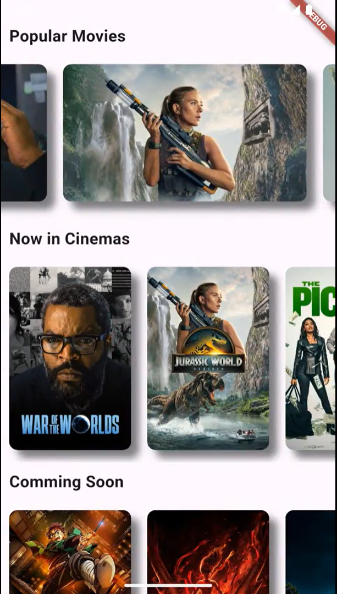
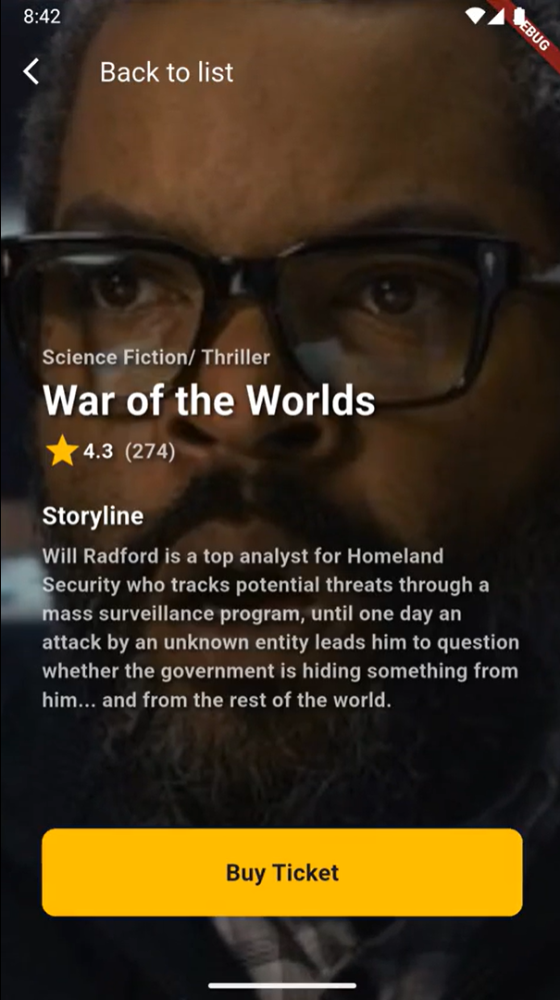

# 🎬 Any Movie

> 영화 API를 연동한 영화 정보 탐색 앱

Flutter 10주 스터디 졸업 과제

---

## 📌 프로젝트 소개

외부 영화 API와 연동하여 인기 영화, 현재 상영작, 개봉 예정작을 카테고리별로 탐색하고,  
영화를 선택하면 Hero 애니메이션과 함께 상세 정보(장르, 별점, 줄거리)를 확인할 수 있는 앱입니다.

---

## 🛠️ 기술 스택

| 분류 | 기술 |
|:---|:---|
| **Language** | Dart |
| **Framework** | Flutter |
| **패키지** | `http` |
| **API** | TMDB 기반 API |

---

## 🎯 핵심 기능 & 구현 상세

### 1. REST API 연동 (`ApiService`)
- `http` 패키지를 사용한 비동기 HTTP GET 요청
- 4개의 API 엔드포인트 연동:
  - `/popular` — 인기 영화
  - `/now-playing` — 현재 상영작
  - `/coming-soon` — 개봉 예정작
  - `/movie?id=` — 영화 상세 정보
- JSON 응답을 `MovieModel`, `MovieDetailModel`로 파싱

### 2. 카테고리별 영화 리스트 (`HomeScreen`)
- **Popular Movies** — `backdrop_path` 활용, 가로 300px 와이드 카드
- **Now in Cinemas** — 포스터 썸네일, 가로 150px 카드
- **Coming Soon** — 포스터 썸네일, 가로 150px 카드
- `FutureBuilder`로 비동기 데이터 로딩 및 `CircularProgressIndicator` 처리
- `ListView.separated`로 가로 스크롤 리스트 구현

### 3. 영화 상세 화면 (`DetailScreen`)
- `Hero` 위젯으로 리스트 → 상세 화면 간 **공유 요소 전환 애니메이션**
- 포스터를 전체 배경으로 확대 + 반투명 오버레이(`Colors.black.withOpacity(0.3)`)
- `FutureBuilder`로 상세 API를 호출하여 장르, 별점, 투표 수, 줄거리 표시
- "Buy Ticket" CTA 버튼 UI

### 4. 재사용 가능한 위젯 설계 (`Movie`)
- `Movie` 위젯에 `section` 파라미터를 두어, 같은 영화가 다른 섹션에 있어도 Hero 태그가 충돌하지 않도록 `'$section-$id'` 패턴으로 유니크 키 설계

---

## 📂 프로젝트 구조
```
lib/
├── main.dart                       # 앱 진입점
├── models/
│   ├── movie_model.dart            # 영화 리스트용 모델 (id, title, poster, backdrop)
│   └── movie_detail_model.dart     # 영화 상세용 모델 (genre, rating, overview)
├── services/
│   └── api_service.dart            # API 통신 (popular, now-playing, coming-soon, detail)
├── screens/
│   ├── home_screen.dart            # 메인 화면 (3개 카테고리 리스트)
│   └── detail_screen.dart          # 상세 화면 (배경 포스터 + 영화 정보)
└── widgets/
    └── movie_widget.dart           # 재사용 영화 카드 위젯 (Hero + Navigator)
```

---

## 🔗 API 구조
```
Base URL: https://movies-api.nomadcoders.workers.dev

GET /popular          → 인기 영화 리스트
GET /now-playing      → 현재 상영작 리스트
GET /coming-soon      → 개봉 예정작 리스트
GET /movie?id={id}    → 영화 상세 정보

이미지: https://image.tmdb.org/t/p/w500/{path}
```

---

## 📸 스크린샷

<div align="center">
  
  
  
</div>

---

## 🙂 작업 중 겪었던 문제 & 느낀점

개발 과정에서 여러 오류를 만났습니다.
대부분은 위젯 사용법과 관련된 기본적인 문제들이었는데, 예를 들면
ScrollView 위젯 사용 시 범위를 지정하지 않아 제대로 작동하지 않는 문제
Hero 위젯에서 같은 화면 내에 동일한 tag 값을 가진 위젯이 여러 개 존재해서 발생하는 문제
기타등등..아주 많이,,

특히 Hero 위젯 때문에 많이 고생했는데요,
하나의 영화 섹션(예: 인기 영화)은 문제없이 잘 작동하는 반면,
다른 섹션(최신 개봉, 개봉 예정)을 추가하면 제대로 동작하지 않아
문제가 어디서 시작됐는지 파악하는 데 어려움이 컸습니다.

```
════Exception caught by scheduler library ═════
The following assertion was thrown during a scheduler callback:
There are multiple heroes that share the same tag within a subtree.
```

터미널에는 친절하게도 다음과 같은 에러 메시지가 떴지만,
갑작스럽게 쏟아지는 E/AndroidRuntime(Error) 런타임 크래시 로그에 묻혀 한참 뒤에야 발견할 수 있었습니다.
다음부터는 에러가 발생하면 터미널 로그를 더 꼼꼼히 살펴봐야겠다고 다짐했습니다.

그래도 직접 api 연동하고 화면을 구현해보는 과정에서 위젯들과 친해질 수 있었습니다
대략 원하는 UI를 구상하고 구현할 수 있겠다는 자신감도 생겼습니다.
코드 챌린지 리뷰를 보니 자신만의 커스텀을 멋지게 하신 분들도 계시더라구요
그걸 보니 저도 의욕이 생겨서 다음번에는 조금 더 나만의 커스텀된 앱을 만들어보고자 다짐했습니다.

---

## 📝 배운 점

- `http` 패키지를 활용한 REST API 비동기 통신과 JSON 파싱 (`jsonDecode`, `fromJson` 팩토리 패턴)
- `FutureBuilder`를 활용한 비동기 데이터의 로딩/성공/실패 상태 처리
- `Hero` 위젯의 태그 설계 — 동일 데이터가 여러 섹션에 존재할 때 `section-id` 조합으로 충돌 방지
- Model 클래스 분리(`MovieModel` / `MovieDetailModel`)를 통한 관심사 분리와 코드 구조화
- `Navigator.push`를 통한 화면 전환과 데이터 전달

---

## 📎 관련 프로젝트

| 졸업 과제 | 설명 | 링크 |
|---|---|:---:|
| **#1 Interactive Movie** | AnimationController 기반 인터랙티브 UI | [Repo](https://github.com/WAcAW9/2025_FlutterChallenge_Animation) |
| **#2 Any Movie** | 외부 API 연동 영화 앱 (현재) | - |
| **#3 MoodTracker** | Firebase 인증 + DB 감정 기록 앱 | [Repo](https://github.com/WAcAW9/2025_FlutterChallenge_MoodTracker) |
